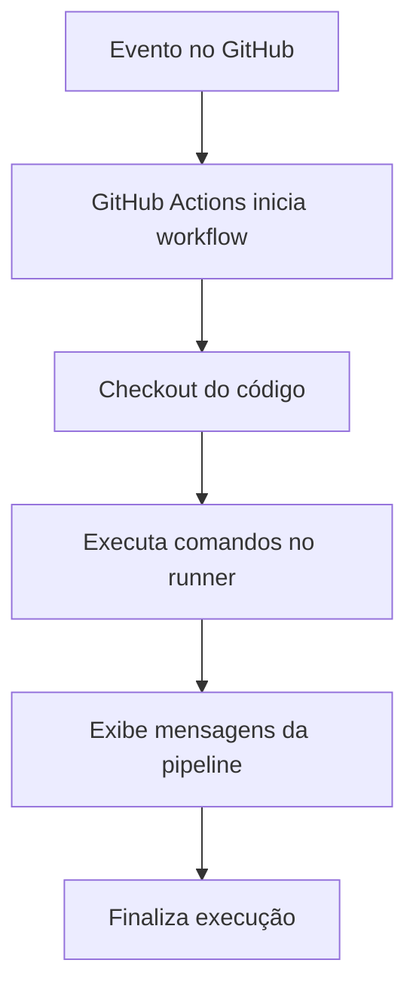

# Pipelines GitHub Actions

<div align="center">
  
  
  
</div>

Este projeto é uma introdução prática ao uso de GitHub Actions para automatizar tarefas em um fluxo simples de desenvolvimento. Ele representa a minha primeira pipeline e serve como base para entender como eventos do repositório disparam ações automáticas.

A aplicação em si é bem simples: uma página HTML estática com um texto de exemplo. A parte mais importante aqui é o controle automatizado do fluxo de trabalho via CI/CD.

---

## 📌 Objetivo do projeto

O objetivo deste repositório é aprender e demonstrar:

- como criar uma pipeline no GitHub Actions;
- como disparar uma execução por eventos como push, pull request e manual;
- como automatizar etapas básicas como checkout, execução de comandos e validação;
- como estruturar um projeto simples para começar a experimentar CI/CD.

---

## 🧩 Estrutura do projeto

```text
Pipelines_Github_Actions/
├── .github/
│   └── workflows/
│       └── ci-cd.yaml
├── index.HTML
├── README.md
└── .git/
```

### Arquivos principais

- `index.HTML`: página de exemplo, bem simples, com um título e um parágrafo.
- `.github/workflows/ci-cd.yaml`: arquivo da pipeline do GitHub Actions.
- `README.md`: documentação do projeto e explicação do fluxo.

---

## 🏗️ Como o projeto funciona

O projeto funciona em duas camadas:

1. A parte visual: a página HTML em si.
2. A parte automatizada: a pipeline que roda quando acontecem certos eventos no GitHub.

A página é apenas uma demonstração visual, enquanto a pipeline é a parte que mostra o conceito de automação.

---

## 🔄 Fluxo da pipeline



### Eventos que disparam a execução

No arquivo `.github/workflows/ci-cd.yaml`, a pipeline foi configurada para reagir a vários gatilhos:

- `pull_request`
- `push`
- `issues`
- `label`
- `schedule`
- `workflow_dispatch`

Isso mostra bem como o GitHub Actions pode ser usado em diferentes momentos do ciclo de desenvolvimento.

---

## ⚙️ Explicando a pipeline

A definição do workflow começa assim:

```yaml
name: pipeline-github-acitons
```

Isso define o nome da pipeline no painel do GitHub.

### Gatilhos principais

```yaml
on:
  pull_request:
    branches:
      - main
      - develop
      - staging
      - feature/*
      - hotfix/*
      - release/*
```

Esse trecho faz a pipeline rodar quando há pull request nas branches principais e de release.

```yaml
  push:
    branches:
      - main
```

Quando acontece um push na branch principal, também dispara a execução.

```yaml
  workflow_dispatch:
    inputs:
      environments:
        description: 'Ambiente de deploy'
        required: true
        default: 'dev'
```

Esse evento permite rodar a pipeline manualmente, escolhendo um ambiente.

---

## 🧪 Job da pipeline

A pipeline possui um job chamado `manual_test_pipeline`:

```yaml
jobs:
  manual_test_pipeline:
    runs-on: ubuntu-latest
```

Isso significa que a execução roda em um runner Linux da GitHub Actions, usando a máquina virtual padrão do GitHub.

### Etapas executadas

```yaml
steps:
  - name: Checkout code
    uses: actions/checkout@v4
```

Essa etapa baixa o código do repositório para a máquina da pipeline.

Depois, são executados comandos simples:

```yaml
  - name: command
    run: echo "Teste de pipeline manual"

  - name: Build my App
    run: echo "Build my App"
```

Esses passos demonstram o básico da automação:

- validar que o workspace foi carregado;
- executar comandos de terminal;
- simular uma etapa de build ou validação inicial.

---

## 🧠 O que essa primeira pipeline ensina

Mesmo sendo um projeto simples, esse workflow ensina os fundamentos de CI/CD:

- o repositório dispara ações automaticamente;
- o GitHub Actions monta um ambiente de execução;
- o código é acessado e processado;
- comandos podem validar, compilar ou testar algo;
- o processo pode ser manual, automático ou agendado.

Em outras palavras, é uma introdução muito boa para entender como pipelines reais funcionam em projetos maiores.

---

## 🌱 Como essa pipeline se relaciona com o projeto

Como a aplicação é apenas um HTML estático, a pipeline não faz deploy real ou build complexo. Ela funciona como um laboratório de aprendizagem.

O que ela faz aqui é validar o fluxo de automação e mostrar que:

- o repositório está sendo observado;
- quando houver mudanças ou eventos, a pipeline pode reagir;
- comandos podem ser executados em um ambiente limpo.

---

## 🚀 Próximos passos possíveis

Esse projeto pode evoluir bastante. Algumas ideias para continuar a jornada:

- validar HTML com ferramentas de checagem;
- rodar testes automatizados;
- publicar a página no GitHub Pages;
- adicionar deploy em ambiente de teste e produção;
- criar pipeline separada para build, testes e deploy;
- aprender a usar cache e artefatos de build.

---

## 🏁 Conclusão

Este repositório representa uma etapa inicial muito importante no aprendizado de automação com GitHub Actions. Ele mostra de forma simples e visual como uma pipeline pode ser acionada e como ela executa passos básicos em um ambiente controlado.

É uma primeira pipeline, mas já entrega a ideia central do CI/CD:

> automatizar tarefas repetitivas, reduzir erros manuais e deixar o fluxo de desenvolvimento mais organizado.

Se você estiver começando com GitHub Actions, este projeto é um ótimo ponto de partida.

---

## 📝 Observação final

O arquivo `.github/workflows/ci-cd.yaml` está estruturado como um exemplo de estudo, então ele pode ser melhorado ao longo do tempo com regras mais reais, como validação de build, testes, upload de artefatos e publicação de aplicação.

Essa é a essência da sua primeira pipeline: aprender o conceito antes de evoluir para cenários mais avançados.
